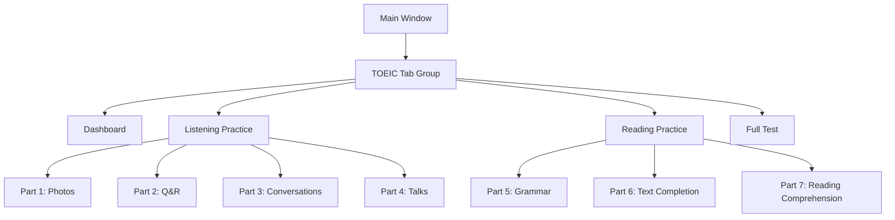

# 🎨 DESIGN: TOEIC Module

**Created:** 2026-02-05
**Status:** Draft - Pending Review

---

## 1. Database Schema (SQLModel)

### 1.1 ToeicQuestion

```python
class QuestionType(str, Enum):
    PHOTO = "photo"           # Part 1
    QR = "qr"                 # Part 2 (Question-Response)
    CONVERSATION = "conversation"  # Part 3
    TALK = "talk"             # Part 4
    GRAMMAR = "grammar"       # Part 5
    TEXT_COMPLETION = "text"  # Part 6
    READING = "reading"       # Part 7

class ToeicQuestion(SQLModel, table=True):
    __tablename__ = "toeic_questions"
    
    id: Optional[int] = Field(default=None, primary_key=True)
    
    # Classification
    part: int = Field(index=True)  # 1-7
    question_type: str = Field(max_length=20)
    difficulty: int = Field(default=3)  # 1-5
    topic: Optional[str] = Field(default=None, max_length=50)  # Office, Travel...
    
    # Content
    question_text: Optional[str] = Field(default=None)  # Câu hỏi (if any)
    passage: Optional[str] = Field(default=None)  # Đoạn văn (Part 6-7)
    options: List[str] = Field(sa_column=Column(JSON))  # ["A", "B", "C", "D"]
    correct_answer: str = Field(max_length=1)  # A/B/C/D
    explanation: Optional[str] = Field(default=None)
    
    # Media
    audio_path: Optional[str] = Field(default=None)  # Part 1-4
    image_path: Optional[str] = Field(default=None)  # Part 1
    
    # Metadata
    test_id: Optional[int] = Field(default=None, index=True)
    created_at: datetime = Field(default_factory=datetime.utcnow)
```

### 1.2 ToeicTest

```python
class ToeicTest(SQLModel, table=True):
    __tablename__ = "toeic_tests"
    
    id: Optional[int] = Field(default=None, primary_key=True)
    name: str = Field(max_length=100)  # "ETS 2024 Test 1"
    test_type: str = Field(max_length=20)  # full/mini/part
    total_questions: int = Field(default=200)
    time_limit: int = Field(default=120)  # minutes
    created_at: datetime = Field(default_factory=datetime.utcnow)
```

### 1.3 ToeicUserProgress

```python
class ToeicUserProgress(SQLModel, table=True):
    __tablename__ = "toeic_user_progress"
    
    id: Optional[int] = Field(default=None, primary_key=True)
    user_id: int = Field(index=True)
    question_id: int = Field(index=True)
    
    user_answer: str = Field(max_length=1)  # A/B/C/D
    is_correct: bool
    time_spent: int = Field(default=0)  # seconds
    answered_at: datetime = Field(default_factory=datetime.utcnow)
```

### 1.4 ToeicStudySession

```python
class ToeicStudySession(SQLModel, table=True):
    __tablename__ = "toeic_study_sessions"
    
    id: Optional[int] = Field(default=None, primary_key=True)
    user_id: int = Field(index=True)
    
    session_type: str = Field(max_length=20)  # vocabulary/listening/reading/test
    part: Optional[int] = Field(default=None)
    
    started_at: datetime = Field(default_factory=datetime.utcnow)
    ended_at: Optional[datetime] = Field(default=None)
    
    correct_count: int = Field(default=0)
    total_count: int = Field(default=0)
    estimated_score: Optional[int] = Field(default=None)
```

---

## 2. Service Layer

### 2.1 ToeicService (frontend/services/toeic_service.py)

```python
class ToeicService:
    
    # Questions
    def get_questions_by_part(self, part: int, limit: int = 30) -> List[ToeicQuestion]
    def get_random_questions(self, part: int, count: int) -> List[ToeicQuestion]
    
    # Progress
    def save_answer(self, user_id: int, question_id: int, answer: str, time_spent: int) -> bool
    def get_user_stats(self, user_id: int) -> Dict[str, Any]
    def get_accuracy_by_part(self, user_id: int) -> Dict[int, float]
    
    # Sessions
    def start_session(self, user_id: int, session_type: str, part: int = None) -> int
    def end_session(self, session_id: int) -> Dict[str, Any]
    
    # Score Estimation
    def calculate_estimated_score(self, user_id: int) -> Tuple[int, int, int]
    def get_weak_points(self, user_id: int, limit: int = 3) -> List[str]
```

---

## 3. Estimated Score Algorithm

```python
def calculate_estimated_score(user_id: int) -> Tuple[int, int, int]:
    """
    Tính điểm dự đoán dựa trên 50 câu gần nhất.
    
    TOEIC Scoring:
    - Listening: 5 - 495 (100 questions)
    - Reading:   5 - 495 (100 questions)
    - Total:    10 - 990
    
    Công thức đơn giản:
    score = 5 + (accuracy * 490)
    """
    lc_accuracy = get_recent_accuracy(user_id, parts=[1,2,3,4], limit=50)
    rc_accuracy = get_recent_accuracy(user_id, parts=[5,6,7], limit=50)
    
    lc_score = int(5 + lc_accuracy * 490)
    rc_score = int(5 + rc_accuracy * 490)
    
    return lc_score, rc_score, lc_score + rc_score
```

---

## 4. File Structure

```
frontend/
├── models/
│   └── toeic.py                    # [NEW] All TOEIC models
├── services/
│   └── toeic_service.py            # [NEW] TOEIC service layer
└── ui/
    ├── tabs/
    │   ├── toeic_listening_tab.py  # [NEW] Listening practice
    │   ├── toeic_reading_tab.py    # [NEW] Reading practice
    │   └── toeic_dashboard_tab.py  # [NEW] Progress dashboard
    └── widgets/
        ├── audio_player.py         # [NEW] Audio player widget
        ├── reading_question.py     # [NEW] Reading question widget
        └── stat_card.py            # [NEW] Stats card widget

data/
└── toeic/
    ├── audio/
    │   ├── part1/                  # Part 1 audio files
    │   └── part2/                  # Part 2 audio files
    ├── images/
    │   └── part1/                  # Part 1 photos
    └── questions/
        ├── part1.json              # Question bank
        ├── part2.json
        └── part5.json
```

---

## 5. UI Flow



---

## 6. Implementation Priority

| Priority | Component | Reason |
|----------|-----------|--------|
| 1 | Models (toeic.py) | Foundation |
| 2 | Service (toeic_service.py) | Data access |
| 3 | Audio Player Widget | Needed for Listening |
| 4 | Listening Tab | User's primary need |
| 5 | Reading Tab | Second priority |
| 6 | Dashboard | Track progress |

---

## Next Step

→ `/code phase-01` để tạo models
